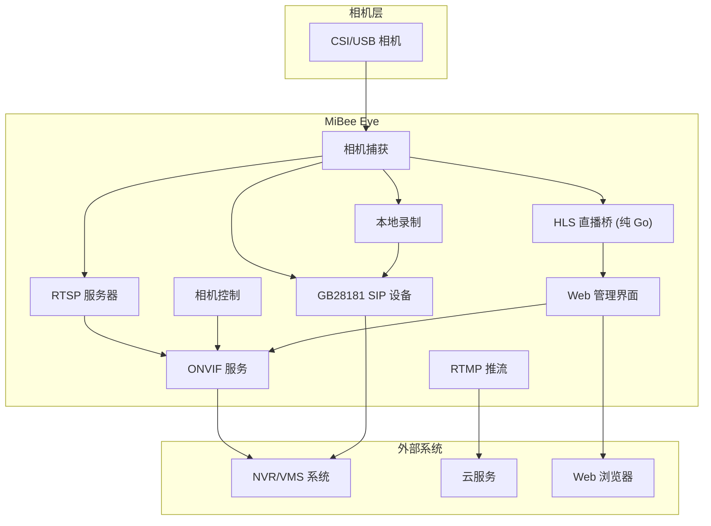

# MiBee Eye (蜂眼)

[](https://github.com/Mi-Bee-Studio/mibee-eye-raspi/actions/workflows/ci.yml)
[](https://golang.org)
[](https://github.com/Mi-Bee-Studio/mibee-eye-raspi/blob/main/LICENSE)

[English](README.md)

<div align="center">
  <table>
    <tr>
      <td align="center"><b>🪶 15–25 MB</b><br><sub>树莓派 3B 实测内存占用</sub></td>
      <td align="center"><b>✅ ONVIF Profile S</b><br><sub>设备 · 媒体 · 成像</sub></td>
      <td align="center"><b>🔧 零 CGO</b><br><sub>纯 Go，交叉编译无痛</sub></td>
    </tr>
  </table>
</div>


MiBee Eye 是一个轻量级的 Go ONVIF 相机服务，支持树莓派、香蕉派、香橙派等单板计算机，兼容所有 CSI/USB 摄像头。它提供 ONVIF 设备/媒体/成像服务、RTSP 流媒体、RTMP 推流、WS-Discovery 支持、HLS 直播流和国际化支持，用于 NVR/VMS 集成。

## 功能

- **ONVIF 设备/媒体/成像服务** - 完全符合 ONVIF 标准，支持 NVR 集成
- **RTSP 流媒体** - H.264 视频流，支持可配置的分辨率和码率
- **RTMP 推流** - 推送到阿里云、Twitch、YouTube 等云服务
- **WS-Discovery** - 网络自动发现相机
- **GB28181 接入** - SIP 注册、Catalog/RecordInfo 查询、直播/回放/下载 PS 流（UDP/TCP）、SIP INFO 回放控制（暂停/恢复/拖动/倍速）
- **本地录制** - 持续 H.264 分段 + `index.jsonl` 索引，保留天数与容量上限；作为 GB28181 回放源
- **HLS 直播流** - 纯 Go MPEG-TS 分段器，支持 Web 直播流（无 ffmpeg 依赖）
- **国际化支持** - 中英文界面切换 (i18n)
- **Web 管理界面** - 基于 token 认证的登录页面，支持 HLS 视频播放器，语言和主题切换，快照功能

- **相机控制** - 亮度、对比度、饱和度、锐度调节
- **快照支持** - 通过 HTTP 端点获取 JPEG 快照
- **低内存占用** - 约 15-30MB RAM 使用量
- **跨平台构建** - 从 x86 工作站交叉编译到 aarch64 树莓派

## 快速开始

```bash
# 克隆并构建
git clone https://github.com/Mi-Bee-Studio/mibee-eye-raspi
cd mibee-eye-raspi

# 复制并配置
cp configs/config.example.yaml config.yaml
# 编辑 config.yaml 配置相机和网络

# 直接运行
./build/mibee-eye -config config.yaml

# 或使用 systemd 部署
sudo cp deploy/mibee-eye.service /etc/systemd/system/
sudo systemctl daemon-reload
sudo systemctl enable --now mibee-eye
```

## 配置

查看 `configs/config.example.yaml` 了解所有配置选项。主要设置包括：

- `camera.width/height` - 采集分辨率（默认 1280x720）
- `camera.fps` - 每秒帧数（树莓派 3B 默认 15）
- `camera.bitrate` - 视频码率（比特/秒）
- `rtsp.port` - RTSP 流媒体端口（默认 8554）
- `onvif.port` - ONVIF HTTP/SOAP 端口（默认 8080）
- `onvif.username/password` - ONVIF 认证凭据
- `web.enabled` - 启用 Web 管理界面（默认 true）
- `web.port` - Web 界面 HTTP 端口（默认 8088）
- `gb28181.enabled` - 向 SIP 平台注册（默认 false）
- `gb28181.transport` - SIP 传输：`udp` 或 `tcp`（默认 udp）
- `recording.enabled` - 持续本地录制（默认 false）
- `recording.storage_path/segment_secs/retention_days/max_storage_mb` - 录制目录与清理策略（默认：`recordings` / 600 / 3 / 8192）


环境变量使用 `MIBEE_EYE_` 前缀覆盖任何配置设置：
```bash
MIBEE_EYE_ONVIF_PASSWORD=secret ./build/mibee-eye
```

## 部署

基于 `deploy/mibee-eye.service` 创建 systemd 服务单元。根据你的环境自定义：

```bash
# 安装和配置
sudo cp deploy/mibee-eye.service /etc/systemd/system/
# 为你的设置编辑路径和用户
sudo systemctl daemon-reload
sudo systemctl enable --now mibee-eye

## Web 管理界面

内置 Web 管理面板提供实时相机管理功能：

- **实时预览** - 使用 **HLS (hls.js) 和 MSE (Media Source Extensions)** 播放器实现灵活的浏览器直播
- **图像控制** - 亮度、对比度、饱和度、锐度滑块；白平衡和曝光模式下拉框
- **服务配置** - 查看所有配置项，编辑 ONVIF 凭据并保存重启
- **语言切换** - 中文/English 界面语言切换
- **主题切换** - 深色/浅色主题切换
- **快照按钮** - 一键获取相机 JPEG 快照
- **WebSocket** - 实时参数更新，无需轮询

通过 `http://<设备IP>:8088/` 访问，使用 **token-based 认证** 的登录页面。


Web 界面通过 `//go:embed` 嵌入到二进制文件中，无需额外文件部署。

## 支持的摄像头

| Module | Sensor | Resolution | Focus | DT Overlay | Notes |
|--------|--------|------------|-------|------------|-------|
| Pi Camera V1 | OV5647 | 2592×1944 | Fixed | `ov5647` | 当前配置 |
| Pi Camera V2 | IMX219 | 3280×2464 | Fixed | `imx219` | 更好的低光性能 |
| Pi Camera V3 | IMX708 | 4608×2592 | Autofocus | `imx708` | PDAF，HDR 支持 |
| Pi HQ Camera | IMX477 | 4056×3040 | Manual lens | `imx477` | 可更换镜头 |
| USB (UVC) | Various | Various | Various | Auto-detected | `/dev/video*` |

## 架构



相机采集通过 CSI 接口，支持 OV5647、IMX219、IMX708、IMX477 等模块。RTSP 服务器使用与 MediaMTX 相同的 gortsplib 库。ONVIF 服务提供完整的设备发现、媒体控制和图像参数调节。RTMP 推流支持云服务。GB28181 向 SIP 平台注册（UDP/TCP）并推送直播/回放/下载 PS 流；本地录制为 GB28181 RecordInfo 查询与回放 INVITE 提供片源。

### 性能对比

| 指标 | MiBee Eye | MediaMTX | 改善 |
|--------|---------|----------|-------------|
| 内存占用 | **15–25 MB** | ~45 MB | 降低 45–67% |
| ONVIF 服务端 | ✅ **Profile S**（设备/媒体/成像） | ❌ 不支持 | — |
| CGO 依赖 | **零 CGO** | 需要 CGO | 交叉编译无痛 |
| 相机控制 | ✅ 亮度、对比度、白平衡等 | ❌ 无 | — |
| RTMP 推流 | ✅ 内置 | ❌ 无 | — |
| CPU 使用率（720p@15fps） | ~15% | ~24% | 降低 37% |
### 技术栈

| 组件 | 库 | 选择理由 |
|-----------|---------|-----------|
| ONVIF 服务端 | 手写 SOAP | 纯 Go，完整的 Device/Media/Imaging |
| RTSP 服务器 | `bluenviron/gortsplib/v5` | MediaMTX 同款库，兼容性有保证 |
| RTMP 推流 | 纯 Go 实现 | Go 原生，资源占用低，维护活跃 |
| HLS 直播桥 | 纯 Go MPEG-TS 分段器 | 无外部依赖，轻量级 |
| Web UI | embedded（无外部库） + hls.js | 轻量级，无外部依赖 |
| 相机捕获 | MediaMTX rpicam（子进程） | 经过验证的 libcamera 接口，无需 CGO |
| 配置管理 | YAML | 人类可读，易于部署 |
纯 Go 构建 — **零 CGO 依赖**。相机采集通过子进程调用 MediaMTX 的 mtxrpicam 二进制文件，既利用了成熟的 libcamera 接口，又避免了 CGO 交叉编译的麻烦。所有协议（ONVIF、RTMP、HLS、快照）均由纯 Go 实现，无需外部库。

## 开发

```bash
# 在工作站构建
make build

# 交叉编译到树莓派 3B
make build GOOS=linux GOARCH=arm64

# 运行测试
make test

# 部署到远程主机
make deploy REMOTE_HOST=user@your-rpi-host
```

## 许可证

MIT License - 详见 [LICENSE](LICENSE)